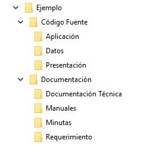
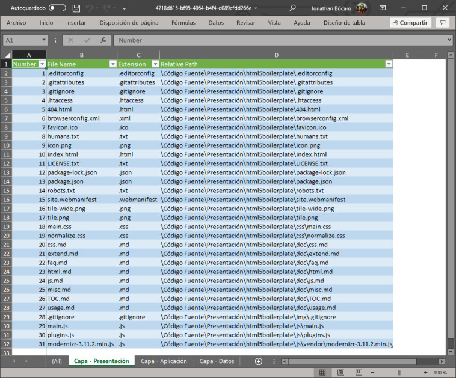
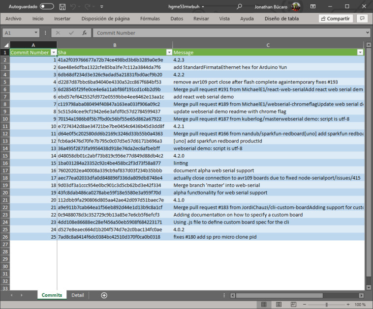
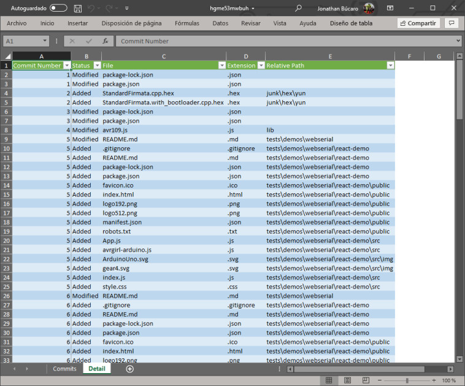

# Blink


[](https://jonathanbucaro.visualstudio.com/Blink/_build/latest?definitionId=8&branchName=Dev)

Blink es una aplicación de Windows que puede realizar por medio de __plugins__ cuatro actividades principales (por defecto), estas actividades son accesibles al abrir el menú contextual sobre una carpeta:

+ Generar una estructura de carpetas de acuerdo a lo definido en un archivo de configuración
+ Listar el contenido (archivos) de una carpeta en un archivo Excel. Dentro del archivo Excel se pueden listar los archivos en diferentes hojas, dependiendo de etiqueta asociada a la carpeta en el archivo de configuración.
+ Eliminar los directorios hijos que se encuentren actualmente vacíos.
+ Listar la bitácora de los últimos 25 commits en la rama del directorio de trabajo y los archivos afectados. Una hoja para los datos de los mensajes de commit y autores, y otra para el detalle de los archivos.

## Configuración en común para folder y spreadsheet
El siguiente es un ejemplo de archivo de configuración que se coloca en la carpeta Blink\CommonConfiguration dentro de los Documentos del usuario.

```json
[
    {
        "name": "Código Fuente",
        "subfolders": [
            {
                "name": "Presentación",
                "label": "Capa - Presentación"
            },
            {
                "name": "Aplicación",
                "label": "Capa - Aplicación"
            },
            {
                "name": "Datos",
                "label": "Capa - Datos"
            }
        ]
    },
    {
        "name": "Documentación",
        "browsable": false,
        "subfolders": [
            {
                "name": "Requerimiento"
            },
            {
                "name": "Minutas"
            },
            {
                "name": "Manuales"
            },
            {
                "name": "Documentación Técnica"
            }
        ]
    }
]
```

## -a folder
Creará la siguente estructura de carpetas dento de la carpeta seleccionada como carpeta de trabajo:



## -a spreadsheet
Siguiendo el ejemplo anterior, el plugin spreadsheet creará un archivo de excel con tres pestañas con el nombre de las etiquetas, en donde se listarán los detalles de los archivos que se encuentran en esas carpetas.



## -a cleanse
Esta acción eliminará todas las carpetas que no posean archivos en su interior, dentro del directorio actual de trabajo

## -a gitlog
Esta acción listará los últimos 25 commits en la rama que se encuentre activa en caso el directorio actual de trabajo sea un repositorio git




El proyecto se encuentra desarrollado en C# y el instalador fue realizado con Inno Setup. Se colocaron los permisos mínimos como para poder realizar la instalación sin privilegios de usuario administrador, y únicamente se instala para el usuario actual. El directorio de instalación es __%appdata%\Blink__.

Se agregó la ruta __Blink\CommonConfiguration__ ubicado en __%HOMEPATH%\Documents__ para almacenar el archivo de configuración __folder.settings.json__ utilizado por los plugins FolderStructure y Spreadsheet.

## Mejoras en funcionalidad que me gustaría realizar
El proyecto esta sujeto a muchas mejoras, así­ que *sugerencias y modificaciones son bienvenidas!*

Estas son algunas de las mejoras que me gustaría realizar.

+ ~~Agregar otra opción para modificar el archivo de configuración en el menú contextual.~~
+ ~~Funcionalidad de Plugins.~~
+ Agregar más pantallas en el instalador que demuestren la utilidad de la aplicación
+ Detectar la configuración del sistema operativo y dependiendo, ofrecer como mínimo la versión en español (castellano) o la versión de inglés como mínimo.

<hr>

## Construído con
+ C#
+ Newtonsoft JSON
+ EPPlus
+ LibGit2Sharp
+ Inno Setup

<hr>

## Iconos utilizados
+ [Recepkutuk](https://www.iconfinder.com/recepkutuk)
+ [Igorverizub](https://www.iconfinder.com/igorverizub)
+ [Glyphlab](https://www.iconfinder.com/glyphlab)
+ [Pocike](https://www.iconfinder.com/pocike)
