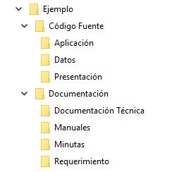

# Blink


Es una aplicación de Windows que puede realizar tres actividades, estas actividades son accesibles al abrir el menú contextual sobre una carpeta:

+ Generar una estructura de carpetas de acuerdo a un archivo de configuración
+ Listar el contenido de una carpeta en un archivo Excel. Dentro del archivo Excel se pueden listar los archivos en diferentes pestañas, y dependiendo de la configuración y la carpeta en la que estos actualmente se encuentren.
+ Eliminar los directorios hijos que se encuentren actualmente vacíos.


Por ejemplo, el siguiente archivo de configuración:

```json
[
    {
        "name": "Código Fuente",
        "branch": [
            {
                "name": "Presentación",
                "label": "Capa - Presentación"
            },
            {
                "name": "Aplicación",
                "label": "Capa - Aplicación"
            },
            {
                "name": "Datos",
                "label": "Capa - Datos"
            }
        ]
    },
    {
        "name": "Documentación",
        "browsable": false,
        "branch": [
            {
                "name": "Requerimiento"
            },
            {
                "name": "Minutas"
            },
            {
                "name": "Manuales"
            },
            {
                "name": "Documentación Técnica"
            }
        ]
    }
]
```
Creará la siguente estructura de carpetas dento de la carpeta seleccionada, en este caso la carpeta raíz *Ejemplo*:



El proyecto se encuentra desarrollado en C# y el instalador fue realizado con Inno Setup. Se colocaron los permisos mínimos como para poder realizar la instalación sin privilegios de usuario administrador, y únicamente se instala para el usuario actual.

El proyecto esta sujeto a mejoras, así­ que *sugerencias y modificaciones son bienvenidas!*

## Mejoras en funcionalidad que me gustaría realizar
+ Agregar más pantallas en el instalador que demuestren la utilidad de la aplicación
+ Agregar otra opción para modificar el archivo de configuración en el menú contextual.
+ Detectar la configuración del sistema operativo y dependiendo, ofrecer como mínimo la verisón en español (castellano) o la versión de inglés como mínimo.
+ Agregar un mejor manejo de errores, considero que no debería tener tantos try catch al utilizar las clases de Blink_Lib, tal vez agregarle una clase que guarde el código de error y mensaje, ya que de esa manera aprovecho la funcionalidad del estado de la operación.

<hr>

## Construído con
+ C#
+ Newtonsoft JSON
+ EPPlus